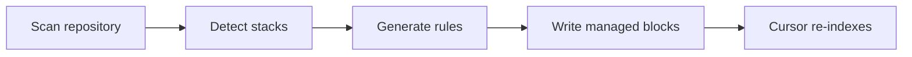

# build-cursorignore

<p align="center">
  <strong>Auto-generate `.cursorignore` and `.cursorindexingignore` for any project.</strong><br />
  Reduce noise, improve indexing, and keep Cursor focused on the files that matter.
</p>

<p align="center">
  <a href="#-quick-start">Quick Start</a> ·
  <a href="#-why-this-exists">Why This Exists</a> ·
  <a href="#-how-it-works">How It Works</a> ·
  <a href="#-supported-stacks">Supported Stacks</a> ·
  <a href="#-faq">FAQ</a>
</p>

<p align="center">
  
</p>

---

## Why this exists

Modern repositories collect a lot of content that is useful for builds but not useful for AI assistance:

* dependency folders
* build output
* generated assets
* caches
* logs
* vendor packages
* local environment files
* binary or secret-like files

When those paths are left unfiltered, Cursor can waste context and indexing effort on low-value files.

`build-cursorignore` scans your repository, detects the stack or stacks in use, and writes practical ignore rules so Cursor spends less time on noise and more time on the code that matters.

<p align="center">
  
</p>

## What it does

* Detects common project stacks automatically
* Generates baseline ignore rules from the repository structure
* Writes both `.cursorignore` and `.cursorindexingignore`
* Preserves your custom rules inside managed blocks
* Works well in monorepos and mixed-language repos

## Quick start

### Install

```bash
npx skills add Tlkh201313/Build-cursorignore-skill-v2 -a cursor
```

### Run in Cursor

```bash
/build-cursorignore
```

That is usually enough. The skill scans the project, builds the ignore files, and exits.

## What gets generated

### `.cursorignore`

Hard exclusion.

Use this for files and folders that should not be included in Cursor AI context.

Typical examples:

```text
node_modules/
vendor/
dist/
build/
.env.local
*.pem
*.key
```

### `.cursorindexingignore`

Indexing exclusion.

Use this for content you do not want indexed, but may still want to reference manually with `@` when needed.

Typical examples:

```text
coverage/
.cache/
.next/
.nuxt/
__pycache__/
*.log
```

## How it works



The skill looks for common indicators such as:

* `package.json`
* `requirements.txt`
* `pyproject.toml`
* `Cargo.toml`
* `go.mod`
* `Gemfile`
* framework-specific config files

It can handle single projects, nested apps, and monorepos.

## Supported stacks

`js_ts`, `next_js`, `nuxt`, `vite`, `remix`, `svelte`, `astro`, `python`, `django`, `flask`, `java`, `kotlin`, `rust`, `go`, `php`, `ruby`, `rails`, `ios_swift`, `android`, `bun`, `deno`, `flutter`, `elixir`, `scala`

## Safe to rerun

The generated rules are written inside managed blocks, so your custom lines outside those blocks stay intact.

```text
# >>> build-cursorignore:baseline BEGIN >>>
... autogenerated content ...
# <<< build-cursorignore:baseline END <<<
```

Run `/build-cursorignore` again whenever the repository changes.

## Try it

After running the skill:

1. Open a fresh Cursor Agent chat so the files are loaded.
2. Wait for re-indexing to finish.
3. Search the codebase for a large ignored folder.
4. Confirm it no longer dominates results.

A quick test is to ask `@Codebase` about a file inside an ignored path such as `node_modules/`. It should not appear unless you reference it directly.

## Recommended use cases

* monorepos
* enterprise repos
* large TypeScript apps
* repos with lots of generated output
* AI-assisted coding workflows
* teams that want cleaner Cursor context

## Screenshots and small visuals

Add these assets for a stronger GitHub presentation:

* `./assets/terminal-sm.gif` — short run demo
* `./assets/before-after-sm.png` — indexing noise vs clean context
* `./assets/flow-sm.png` — repo scan to generated files

A small image block can look like this:

```md
<p align="center">
  
</p>
```

## FAQ

<details>
<summary>Does this overwrite my existing ignore files?</summary>

No. It writes only inside managed blocks and leaves custom content outside those blocks alone.

</details>

<details>
<summary>Do I need both files?</summary>

Usually yes. `.cursorignore` controls AI context, while `.cursorindexingignore` is better for paths you want excluded from indexing but still accessible when explicitly referenced.

</details>

<details>
<summary>Can I rerun it after changes?</summary>

Yes. That is the intended workflow. Rerun the skill after major repo changes, framework additions, or dependency shifts.

</details>

<details>
<summary>What if my repo is tiny?</summary>

You may not need it. The skill is most valuable when a repository contains enough noise that Cursor’s context quality starts to drop.

</details>

<details>
<summary>Can I customize the generated rules?</summary>

Yes. Keep your manual edits outside the managed blocks, or add custom rules after generation if you want to extend the baseline.

</details>

## Contributing

Issues and pull requests are welcome.

If you add support for a new stack, include a reproducible example and make sure the generated rules are safe for reruns.

## License

MIT
